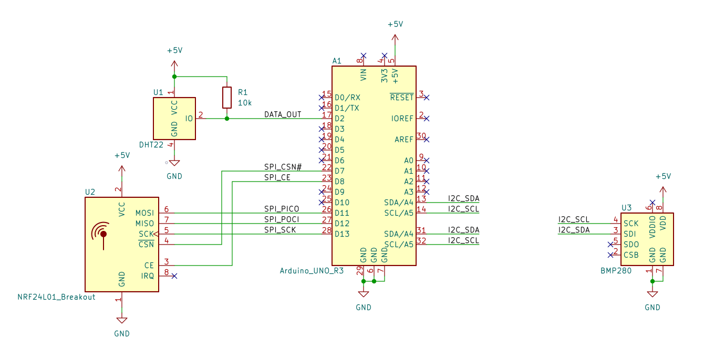
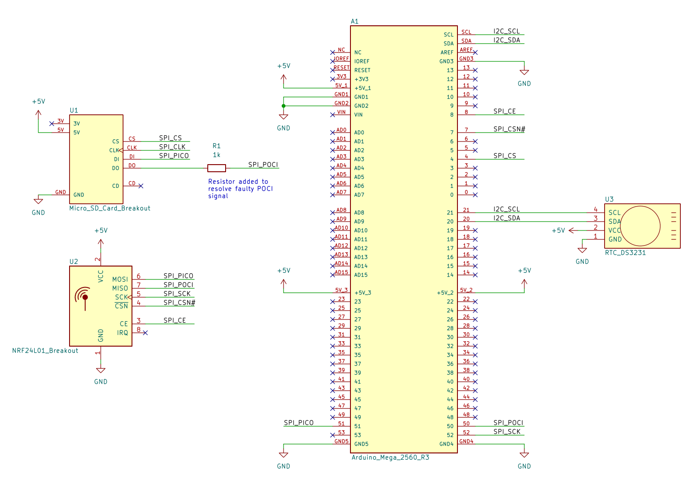
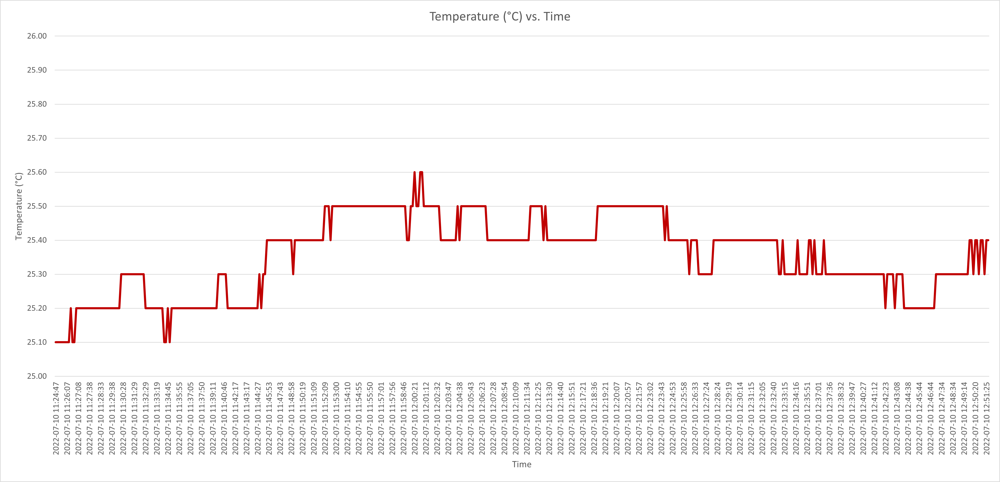
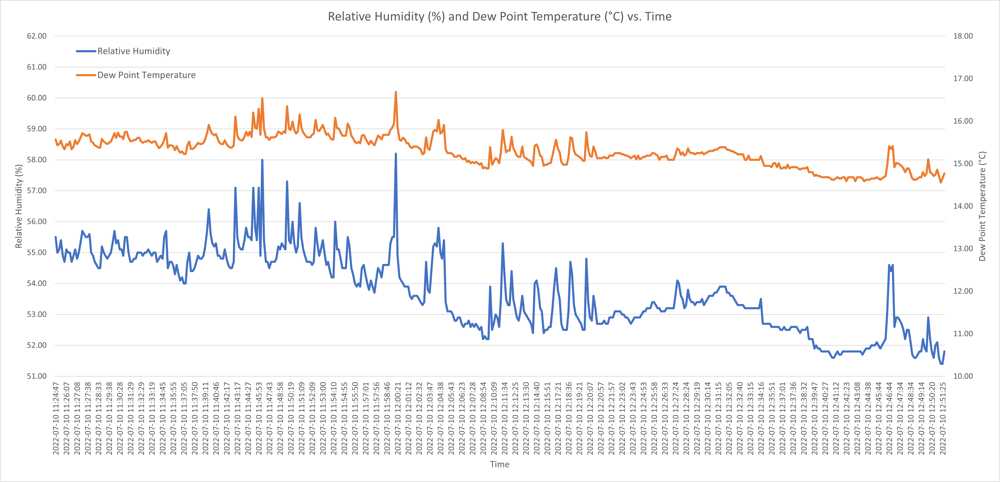
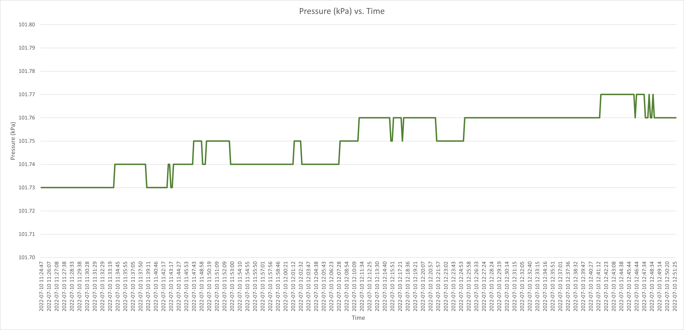
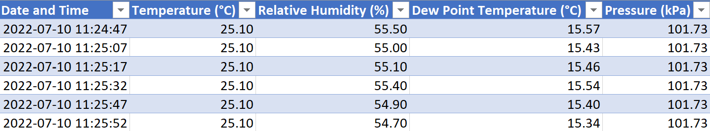

## Background

While commuting in spring 2022, I found myself mesmerized listening to a series of podcasts about climate research in Antarctica. Given the inhospitable nature of the frozen continent, it's unsurprising that a lot of the data collection is done through remote sensing setups, allowing researchers to monitor Antarctica's weather without having to winter there. One such example is the [Antarctic Automatic Weather Station program](https://amrdc.ssec.wisc.edu/about/aws-program).

With this in mind, I wanted to make a remote sensing station as well, albeit designed for my home where the operating conditions aren't as extreme as in Antarctica. The objectives for this project were as follows:

- Measure the temperature, humidity, and pressure in relevant units using sensors connected to a microcontroller (MCU)
- Wirelessly transfer the measurements to a second offsite MCU, which exports the data to MS Excel to be saved and graphed live
- Continuously back up the recordings with timestamps onto a micro SD card
- Produce schematics for my project using an Electronic Design Automation (EDA) program

## System Design

This project required two MCUs, one to transit data and one to receive it. I decided to use Arduino MCUs as I already had some at my disposal.

The transmitter Arduino (TX) was connecting to climate sensors along with a radio frequency (RF) transceiver. The sensors included a DHT22 to measure temperature and humidity, as well as a BMP280 to measure atmospheric pressure. The RF transceiver I used was the NRF24L01, which uses radio waves to transit data. Power to the TX Arduino was provided via a switched-mode power supply connected to AC mains electricity. It would also be possible to power the MCU with a battery, but as this project was within my home, that was unnecessary.

The receiver Arduino (RX) was connected to a micro SD card, a real time clock (RTC), and another NRF24L01 RF transceiver. The specific RTC I used was the DS3231 which can compensate for variances in temperature that would otherwise affect the oscillation frequency of RTCs. This compensation is done through an internal cystal oscillator. The RX Arduino was powered through USB connected to my computer. This USB connection was also used to transfer data from the MCU to Excel over UART.

The schematics for both Arduino MCUs can be seen in Fig. 1 - 2. KiCad was used to make these schematics. The various modules were connected to the MCUs using a handful of communication protocols, including I2C and SPI, the latter of which posed some difficulties as explained later.

{.preview-image}

## Software Design

A separate C program was written for each Arduino MCU. For the TX Arduino code, all the sensor measurements were read and saved into a struct. This contained the temperature, relative humidity, dew point temperature, and atmospheric pressure. Relative humidity is dependent on the temperature and is thus not the best statistic for day-to-day use. Instead, the calculated dew point temperature takes into account both the temperature and relative humidity, providing a much more realistic measure of humidity. Once all the measurements are recorded, the contents of the struct are sent over to the RF transceiver module for transmission.

The RX Arduino program constantly checks to see if any incoming data is present. Once it has found something, it saves the data into a struct of its own. The weather data is also saved to a micro SD card in csv format, along with the time the measurement was taken, provided by the RTC of course. Another function ensures that all the date and time values have leading zeros if they are single digits for consistency. For example, dates appear as 2022-07-01 and not 2022-7-1. Finally, the data is exported to the computer and into Excel, where it is saved into a table and automatically plotted in several graphs.

The full code for this project can be seen [here](https://github.com/teito7000/Remote_Weather_Station).

## Challenges and Debugging

By far the largest difficulty in implementing this project was due to the micro SD card module having a fault. The module used the SPI protocol to communicate with the RX Arduino. However, using it would prevent any other SPI component from being able to talk with the RX Arduino. This was due to the POCI (Peripheral Out, Controller In) signal not being able to into high impedance mode when the micro SD card module was not being used. Effectively, it was always drowning out the signals of the other SPI device, the RF transceiver. As I didn't want to rework the connections on the module, I found another workaround by placing a 1kΩ resistor in series with the module’s POCI pin. This placed some constant resistance. While this solution was the easiest to implement, it was not foolproof and I would recommend looking at other micro SD card modules that don't have a flawed POCI signal layout.

On the programming side, initially I used an array to hold all the sensor measurements. However, it soon became confusing to debug since I couldn't tell which element in the array corresponded with a given measurement. I wanted to add labels to the elements, leading to the change from an array to a struct. Structs enable user-defined names for each element and can also contain different data types, which is useful as the sensor readings had different levels of precision.

## Conclusion

While testing out the system, measurements were transmitted every few seconds to quickly form a large dataset to graph, as seen in Fig. 3 - 5 for a recording span of two hours. It should be mentioned that in practice, a long-term weather station would record and transfer data less frequently, every few minutes or even hours, as this level of granularity may not be required.

Overall, I was very satisfied with the results of this project, as I learned a fair bit about data logging with weather sensors. Beyond the data transfer functionality, the incorporation of MS Excel and the micro SD card also ensured that the recordings were always backed up, providing for an additional layer of redundancy that is often necessary for engineering setups where access to the deployment is restricted.

