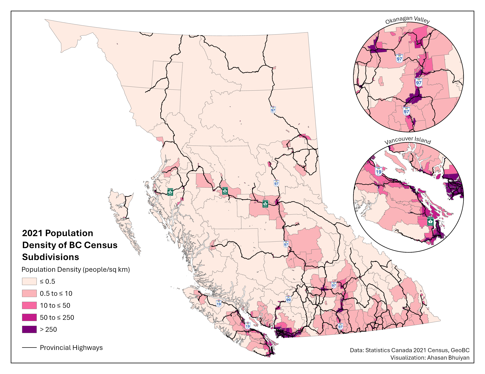

## The Far-flung Province

British Columbia is the third most populated province in Canada, home to over 5.5 million people in 2024. Yet the mountains are tall and the forests are thick, and much of the populace is distributed over a vast landscape. The province's population can be roughly divided into three equal parts: Metro Vancouver, the southern half of Vancouver Island along with the Fraser Valley, and the rest of the province.

<blockquote class="reddit-embed-bq" style="height:500px" data-embed-height="740"><a href="https://www.reddit.com/r/VictoriaBC/comments/1ay7t1z/british_columbia_split_into_3_areas_of_equal/">British Columbia split into 3 areas of equal population</a>  by<a href="https://www.reddit.com/user/emslo/">u/emslo</a> in<a href="https://www.reddit.com/r/VictoriaBC/">VictoriaBC</a></blockquote>

::: callout-note
This map is likely from the mid-2010s, when BC's population was closer to 4.5 million. Nonetheless, the population proportions are similar today.
:::

This population imbalance has historically led to public transit funding being concentrated in the most dense region in the province, Metro Vancouver. Indeed, the province's only internal rail transit systems, the SkyTrain metro and West Coast Express commuter rail, exist primarily in Metro Vancouver (albeit the latter does poke into the Fraser Valley, but its poor implementation leaves [a lot to be desired](https://youtu.be/1PeIOVy6fFc?si=GBXo74tYO-pKdg6O)).

Outside of Metro Vancouver, lower population densities present challenges for public transit, which often relies on higher densities for ridership and a reduction in costs per passenger. That being said, there are population centres clustered alongside existing transportation corridors: provincial highways.

## Corridors Hiding in Plain Sight

{.preview-image}

::: callout-note
The provincial highways were filtered out of GeoBC's Digital Road Atlas (DRA), whose classifications for "highway route" do not always align with the level of physical infrastructure typically associated with highways. For instance, several arterial roads in Metro Vancouver like the Fraser "Highway", Kingsway, and Granville St are listed as highway routes in the DRA, despite having features such as frequent signallized intersections and street parking.
:::

In the Okanagan Valley, Highway 97 cuts past the cities of Penticton, Kelowna, and Vernon, before leading up to Kamloops. While the terrain is challenging, the highway zigzags through mountain ranges and hugs the coastline around Okanagan Lake. Meanwhile on Vancouver Island, from Victoria to the promising [transit hub](https://dailyhive.com/vancouver/hullo-ferries-nanaimo-hub-vancouver-island-public-transit) of Nanaimo and beyond, Highway 1 and Highway 19 connect every major city as they head up the island's eastern coastline. Similar opportunities exist elsewhere, such as Highway 1 in the Fraser Valley and Highway 99 in Squamish–Lillooet. Finally, in the north of BC, highways 97 and 16 form branches connecting the central node of Prince George to other northern communities, Alberta, and the port city of Prince Rupert.

Intercity transit already exists on some of these corridors, but service levels are often poor, and pricing can be a concern depending on the provider. BC Transit's hugely popular (and [perennially overcrowded](https://pub-fvrd.escribemeetings.com/filestream.ashx?DocumentId=23583)) 66 'Fraser Valley Express' bus route runs between Lougheed station in Metro Vancouver and the Fraser Valley municipalities of Abbotsford and Chilliwack, guided by Highway 1. Several private companies offer charter buses on Highway 99 heading north from Metro Vancouver to Squamish and the winter resort town of Whistler. Public transit on Highway 16 has a much darker origin. The roughly 700 km long corridor of Highway 16 between Prince George and Prince Rupert previously had no public transit offerings, leading to hitchhiking among travellers, especially for those who could not afford to own a personal vehicle. The road segment earned the moniker of ["Highway of Tears"](https://highwayoftears.org/) as several people, particularly women of Indigenous backgrounds, went missing or were murdered along the highway. When  Greyhound, a private intercity coach service, ceased operations in BC in 2018, the provincial government finally set up a public transit service, BC Bus North, to run on Highway 16 and other northern routes. Nonetheless, service is extremely limited with only a handful of trips per week.

While highways are not typically associated with public transit, they offer a unique opportunity to introduce long-distance transit services without the need for costly new infrastructure, such as bridges and tunnels. This is particularly significant for Canada, a country which [struggles to build transit infrastructure affordably](https://stateofcitiessummit.ca/files/041224_Understanding-the-Drivers-of-Transit-Construction-Costs-in-Canada-A-Comparative-Study.pdf). Moreover, bus services on existing highways can be implemented in just a few years, whereas rail transit often requires a decade or more of planning and construction ([ahem](https://www.blogto.com/city/2024/11/toronto-eglinton-crosstown-14-year-construction/)). 

Although there are places within BC with existing rail infrastructure, they are often not well-suited for public transit. Some legacy rail routes are circuitous and not competitive with driving, or taking a bus, on the more direct highway instead (e.g., Southern Railway of BC alignment compared to Highway 1 in the Fraser Valley). Other rail alignments are in extremely poor shape or have competing uses by the infrastructure owner, typically the freight rail companies.

That is not to say that intercity rail connections between the aforementioned regions are worthless. Rather, bus service can be started in the interim while a rail transit system, if desired, is designed and implemented. It should be mentioned that regional trains can also make use of highways by running in their median, something which we can learn a lot about from our [Antipodean friends](https://youtu.be/AH1kvXxnBiQ?si=XdkzNAOuDsTdmQCu). 

## No Free Lunch in Transit Planning

Regardless of the mode, careful planning must be done to ensure that transit system works efficiently.

The bus or rail line should leave the highway median to more directly serve significant population centres not adjacent to the transportation artery. For example, while Highway 97 does pass through central Kelowna and connect with the University of British Columbia's Okanagan Campus, transit would be better off taking a diversion through Highway 33 and Rutland Road in the city's eastern neighbourhoods, as that brings transit access closer to the established density, retail, and employment.

Additionally, transit priority measures are key to ensuring that buses and trains remain competitive in regards to travel time and reliability. Intercity transit usually has lower service frequencies than urban transit, with the minutes between departures being measured using at least two digits rather than one, so the service quality once on board must be worth the wait. Corridor-specific analysis can pinpoint infrastructure modifications that can vastly improve consistency of transit service, such as [queue jumps](https://www.linkedin.com/feed/update/urn:li:activity:7274496820959985664/?actorCompanyId=98839757) at points where highway lanes merge. For rail service, grade separation should be pursued wherever possible to eliminate the chances of collisions. This is especially true if the trains are expected to travel at highway speeds or faster, in which case electrification can considerably help with [accelerating](https://x.com/Caltrain/status/1804278237486588179).

## Acknowledgements

Inspiration for this project came from a blog post written by John Ivison (no, not the National Post columnist). While I hope my mapping highlights the untapped potential for public transit along British Columbia's highways, readers are encouraged to read John's [post](https://blog.jivison.dev/a-new-vision-for-intercity-transit-in-bc/) for a more in-depth exploration of what an intercity transit network could entail, including the various constituent routes.